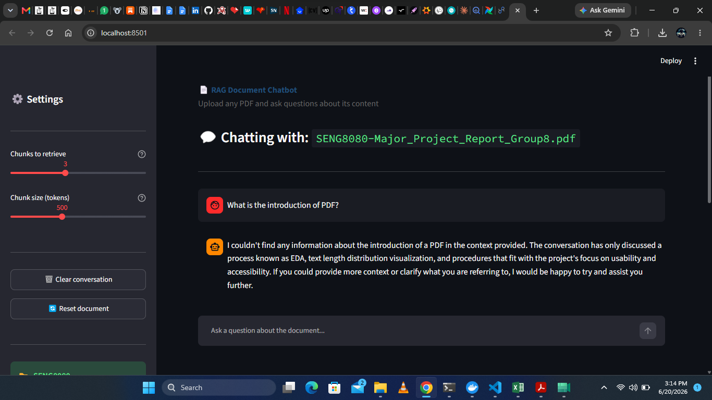
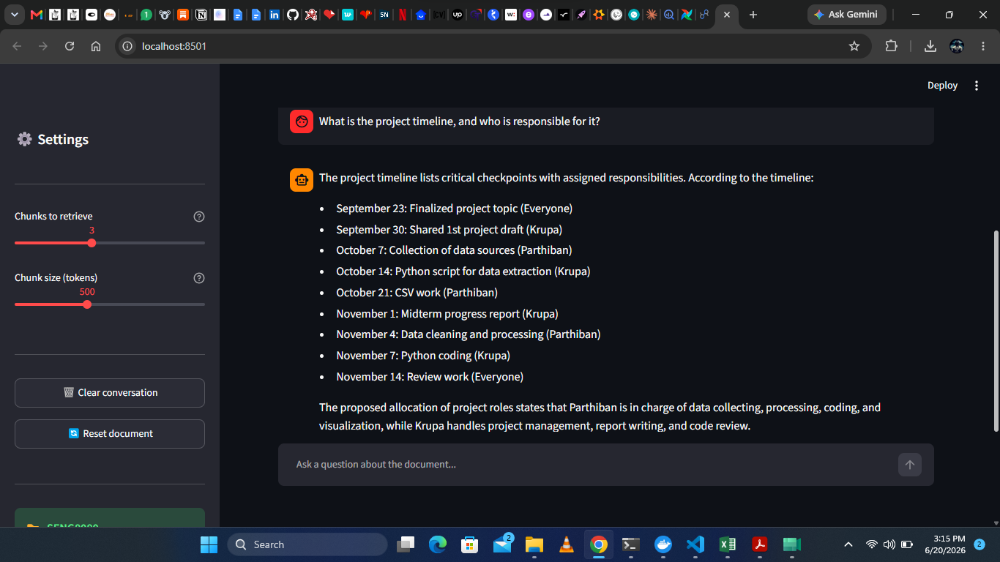
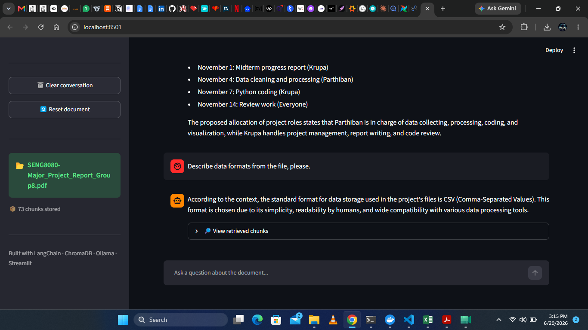

# RAG Document Chatbot


A Retrieval-Augmented Generation (RAG) chatbot that answers questions from any uploaded PDF — fully local, no API keys required.

## Problem

Reading long PDFs to find specific information is slow. This tool lets you upload any document and ask natural language questions, getting accurate answers grounded in the actual document content — not hallucinated.

## Architecture

PDF Upload → PyPDFLoader → RecursiveCharacterTextSplitter → HuggingFace Embeddings → ChromaDB → Similarity Search → Ollama (llama3.2) → Answer

**Pipeline stages:**
1. **Ingest** — PDF loaded page-by-page with PyPDFLoader
2. **Chunk** — Split into 500-token chunks with 50-token overlap for context continuity
3. **Embed** — Each chunk converted to vector embeddings using HuggingFace's `all-MiniLM-L6-v2` (free, runs locally)
4. **Store** — Embeddings stored in ChromaDB with persistent storage
5. **Retrieve** — User query embedded and matched against stored chunks via similarity search (top-k configurable)
6. **Generate** — Retrieved context + conversation history passed to Ollama's llama3.2 for grounded answer generation
7. **Display** — Multi-turn chat interface in Streamlit with conversation memory

## Tech Stack

| Layer | Tool |
|---|---|
| Orchestration | LangChain |
| LLM | Ollama (llama3.2) — runs fully local, no API key |
| Embeddings | HuggingFace Sentence Transformers (all-MiniLM-L6-v2) |
| Vector Store | ChromaDB |
| PDF Parsing | PyPDFLoader |
| UI | Streamlit |
| Language | Python |

## Features

- 📄 Upload any PDF and chat with its content
- 💬 Multi-turn conversation with memory — follow-up questions work naturally
- ⚙️ Configurable chunk size and retrieval count via sidebar
- 🔍 Transparent retrieval — view exactly which chunks were used to generate each answer
- 🆓 Fully free and local — no OpenAI API key needed

## Demo

### Asking a question


### Multi-turn conversation with detailed extraction


### Sidebar settings and chunk transparency


## Key Findings

- Retrieval accuracy is highly dependent on chunk size — 500 tokens with 50 overlap gave the best balance between context completeness and retrieval precision
- The model correctly extracts structured data (dates, names, owners) from unstructured PDF text when given clean retrieved context
- When information isn't in the document, the model correctly responds "I couldn't find that" rather than hallucinating — critical for trustworthy RAG systems

## What I Learned

- Building a complete RAG pipeline from scratch: ingestion, chunking, embedding, vector storage, retrieval, and generation
- Working with local LLMs (Ollama) as a free alternative to paid APIs — useful for cost-conscious or privacy-sensitive applications
- Managing ChromaDB collections, including handling duplicate document re-ingestion
- Implementing conversation memory in Streamlit using session state for natural multi-turn chat
- Tuning retrieval parameters (chunk size, top-k) to improve answer quality

## Setup

```bash
git clone https://github.com/Krupa03/rag-document-chatbot.git
cd rag-document-chatbot
python -m venv venv
venv\Scripts\activate
pip install -r requirements.txt
ollama pull llama3.2
cd src
streamlit run app.py
```

## Run Locally

This app uses Ollama for fully local, free LLM inference. Install Ollama from [ollama.com](https://ollama.com), pull the llama3.2 model, then run the Streamlit app as shown above.
